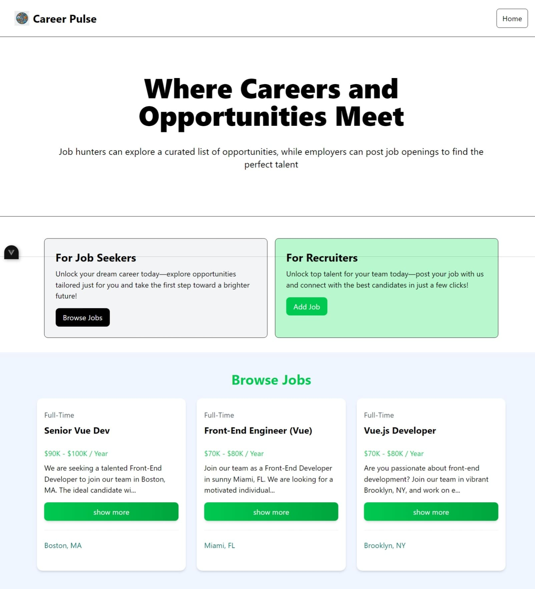

# Career Pulse

## Overview

**Career Pulse** is a job discovery platform where recruiters can upload job information, and job seekers can explore available job opportunities.

## Features

### ✅ Current Features:
- Browse job listings
- View job details

### 🚀 Upcoming Features:
- Recruiters can post jobs
- Search and filter jobs based on criteria
- User authentication for recruiters and job seekers

## Installation

To get started with the **Career Pulse Web**, follow these steps:

1. **Clone the repository:**

    ```bash
    git clone https://github.com/muhammadderic/career-pulse.git
    cd career-pulse
    ```

2. **Install dependencies:**

    ```bash
    npm install
    ```

3. **Run the development server:**

    ```bash
    npm run dev
    ```

    Visit [http://localhost:5173](http://localhost:5173) in your browser to see the app in action.

## Screenshots

<div style="display: flex; justify-content: space-between;">
    
</div>

*Main App Page (left) and Other Page (right)*

## Technologies Used

- **Vue.js** – Frontend framework for building the UI
- **JSON Server** – Mock backend API for job data

## Contributing

Contributions are welcome! If you'd like to contribute to this project, please follow these steps:

1. Fork the repository.
2. Create a new branch for your feature or bugfix.
3. Commit your changes and push your branch.
4. Open a pull request to have your changes reviewed.

## License

This project is licensed under the MIT License. See the [LICENSE](LICENSE) file for more details.

## Contact

If you have any questions or suggestions, feel free to reach out:

- **GitHub**: [muhammadderic](https://github.com/muhammadderic)